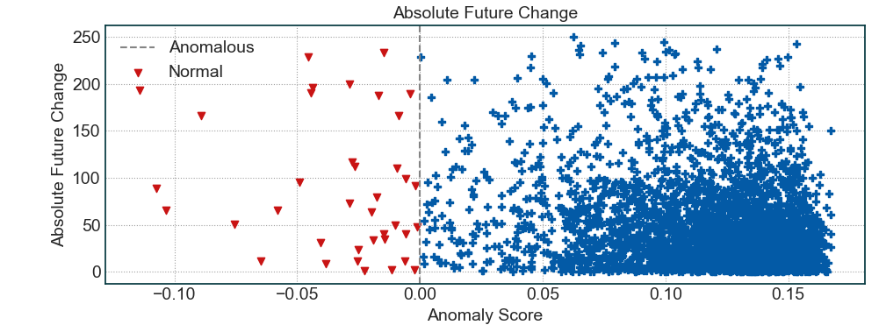

<p align="center">
  
</p>

# Surpriver - Find High Moving Stocks before they Move
Find high moving stocks before they move using anomaly detection and machine learning. Surpriver uses machine learning to look at volume + price action and infer unusual patterns which can result in big moves in stocks.

### Files Description
| Path | Description
| :--- | :----------
| surpriver | Main folder.
| &boxur;&nbsp; dictionaries | Folder to save data dictionaries for later use. 
| &boxur;&nbsp; figures | Figures for this github repositories.
| &boxur;&nbsp; stocks | List of all the stocks that you want to analyze.
| data_loader.py | Module for loading data from yahoo finance.
| detection_engine.py | Main module for running anomaly detection on data and finding stocks with most unusual price and volume patterns.
| feature_generator.py | Generates price and volume return features as well as plenty of technical indicators.

## Usage
### Packages
You will need to install the following package to train and test the models.
- [Scikit-learn](https://scikit-learn.org/)
- [Numpy](https://numpy.org/)
- [Tqdm](https://github.com/tqdm/tqdm)
- [Yfinance](https://github.com/ranaroussi/yfinance)
- [Pandas](https://pandas.pydata.org/)
- [Scipy](https://www.scipy.org/install.html)
- [Ta](https://github.com/bukosabino/ta)

You can install all packages using the following command. Please note that the script was written using python3.
```
pip install -r requirements.txt
```

## Running with Docker
You can also use docker if you know what it is and have some knowledge on how to use it. Here are the steps to run the tool with docker.

- First you must build the container: `docker build . -t surpriver`
- Then you need to copy the contents of docker-compose.yml.template to a new file called docker-compose.yml
- Replace `<C:\\path\\to\\this\\dir>` with the directory you are working in.
- Run the container by executing `docker-compose up -d`
- Execute any of the commands below by prepending `docker exec -it surpriver` to your command line.

### Predictions for Today
If you want to go ahead and directly get the most anomalous stocks for today, you can simple run the following command to get the stocks with the most unusual patterns. We will dive deeper into the command in the following sections.

#### Get Most Anomalous Stocks for Today
##### When you do not have the data dictionary saved and you are running it for the first time.
```
python detection_engine.py --top_n 25 --min_volume 5000 --data_granularity_minutes 60 --history_to_use 14 --is_load_from_dictionary 0 --data_dictionary_path 'dictionaries/data_dict.npy' --is_save_dictionary 1 --is_test 0 --future_bars 0
```
This command will give you the top **25 stocks** that had the highest anomaly score in the last **14 bars** of **60 minute candles**. It will also store all the data that it used to make predictions in the **dictionaries/data_dict.npy** folder. Below is a more detailed explanation of each parameter.
- **top_n**: The total number of most anomalous stocks you want to see.
- **min_volume**: Filter for volume. Any stock that has an average of volume lower than this value will be ignored.
- **data_granularity_minutes**: Data granularity to use for analysis. The available options are *1min, 5min, 15min, 30min, 60min*.
- **history_to_use**: Historical bars to use to analyze the unusual and anomalous patterns.
- **is_save_dictionary**: Whether to save the stock data that is used for analysis in a dictionary or not. Enabling this would save you time if you want to do some further analysis on the data.
- **data_dictionary_path**: Dictionary path where data would be stored.
- **is_load_from_dictionary**: Whether to load the data from dictionary or download it from yahoo finance directly. You can use the dictionary you saved above here for multiple runs.
- **is_test**: You can actually test the predictions by leaving some of the recent data as future data and analyzing whether the most anomalous stocks moved the most after their predictions. If this value is 1, the value of **future_bars** should be greater than 5.
- **future_bars**: These number of bars will be saved from the recent history for testing purposes.
- **output_format**: The format for results. If you pass CLI, the results will be printed to the console. If you pass JSON, a JSON file will be created with results for today's date. The default is CLI.

#####  When you have the data dictionary saved, you can just run the following command.
```
python detection_engine.py --top_n 25 --min_volume 5000 --data_granularity_minutes 60 --history_to_use 14 --is_load_from_dictionary 1 --data_dictionary_path 'dictionaries/data_dict.npy' --is_save_dictionary 0 --is_test 0 --future_bars 0 --output_format 'CLI'
```
Notice the change in **is_save_dictionary** and **is_load_from_dictionary**.

Here is an output of how a single prediction looks like. **Please note that negative scores indicate higher anomalous and unusual patterns while positive scores indicate normal patterns. The lower the better**.

```
Last Bar Time: 2020-08-25 11:30:00-04:00
Symbol: SPI
Anomaly Score: -0.029
Today Volume (Today = Date Above): 313.94K
Average Volume 5d: 206.53K
Average Volume 20d: 334.14K
Volatility 5bars: 0.013
Volatility 20bars: 0.038
Future Absolute Sum Price Changes: 72.87
```

### Test on Historical Data
If you are suspicious of the use of Machine Learning and Artificial Intelligence in trading, you can actually test the predictions from this tool on historical data. The two most important command line arguments for testing are **is_test** and **future_bars**. If the former one is set to 1 and the later one is set to anything more than 5, the tool will actually leave that amount of data for analysis purposes and use the data prior to that for anomalous predictions. Next, it will look at that remaining data to see how well the predictions did. Here is an example of a scatter plot from the following command.

#### Find Anomalous Stocks and Test them on Historical Data
```
python detection_engine.py --top_n 25 --min_volume 5000 --data_granularity_minutes 60 --history_to_use 14 --is_load_from_dictionary 0 --data_dictionary_path 'dictionaries/data_dict.npy' --is_save_dictionary 1 --is_test 1 --future_bars 25
```

If you have already generated the data dictionary, you can use the following command where we set **is_load_from_dictionary** to 1 and **is_save_dictionary** to 0.
```
python detection_engine.py --top_n 25 --min_volume 5000 --data_granularity_minutes 60 --history_to_use 14 --is_load_from_dictionary 1 --data_dictionary_path 'dictionaries/data_dict.npy' --is_save_dictionary 0 --is_test 1 --future_bars 25
```

<p align="center">
  
</p>

As you can see in the image above, the anomalous stocks (score < 0) usually have a higher absolute change in the future on average. That proves that the predictions are actually for those stocks that moved more than average in the next few hours/days. One question arises here, what if the tool is just picking the highest volatility stocks because those would yield high future absolute change. In order to prove that it's not the case, here is the more detailed description of stats you get from the above command.
```
--> Future Performance
Correlation between future absolute change vs anomalous score (lower is better, range = (-1, 1)): **-0.23**
Total absolute change in future for Anomalous Stocks: **89.660**
Total absolute change in future for Normal Stocks: **43.000**
Average future volatility of Anomalous Stocks: **0.332**
Average future volatility of Normal Stocks: **0.585**
Historical volatility for Anomalous Stocks: **2.528**
Historical volatility for Normal Stocks: **2.076**
```

You can see that historical volatility for normal vs anomalous stocks is not that different. However, the difference in total absolute future change is double for anomalous stocks as compared to normal stocks. 

### Support for Crypto Currencies
You can now specify which data source you wold like to use along with which stocks list you would like to use.
```
python detection_engine.py --top_n 25 --min_volume 500 --data_granularity_minutes 60 --history_to_use 14 --is_load_from_dictionary 0 --data_dictionary_path 'dictionaries/feature_dict.npy' --is_save_dictionary 1 --is_test 0 --future_bars 0  --data_source binance --stock_list cryptos.txt
```
- **data_source**: Specifies where to get data from, current supported options are binance and yahoo_finance(default)
- **stocks_list**: Which file in the stocks directory contains the list of tickers to analyze. Default is stocks.txt.
### Results
We will try to post the top 25 results for a single set of parameters every week.
##### August 31, 2020 to September 05, 2020: https://pastebin.com/L5T2BYUx

### Limitations
The tool only finds stocks that have some unusual behavior in their price and volume action combined. It does not predict which direction the stock is going to move. That might be a feature that I'll implement in the future but for right now, you'll need to look at the charts and do your DD to figure that out.

## License
[](https://www.gnu.org/licenses/gpl-3.0)

A product by [Tradytics](https://www.tradytics.com/)

Copyright (c) 2020-present, Tradytics.com

